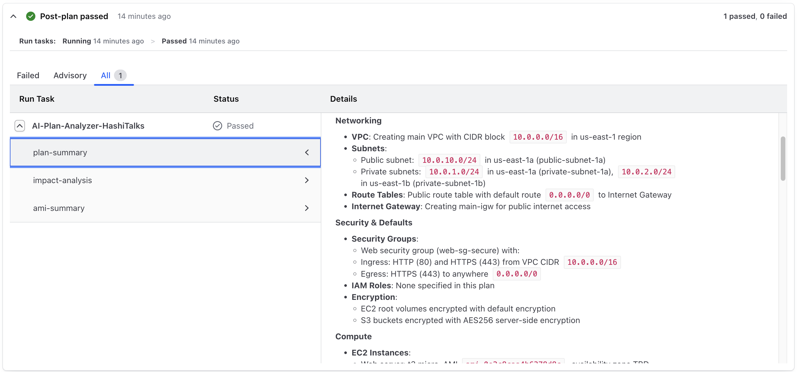
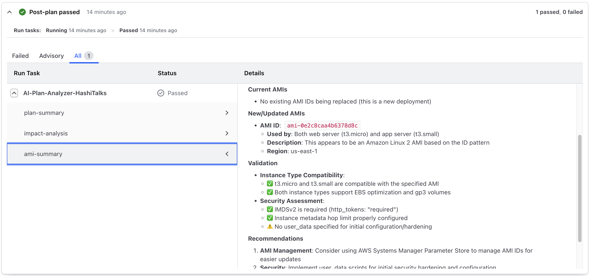

<!-- BEGIN_TF_DOCS -->
# Terraform Run Task: AI-Powered Plan Analyzer

[](https://www.terraform.io/)
[](https://aws.amazon.com/bedrock/)
[](https://www.python.org/)
[](LICENSE)

## Overview

Transform your HashiCorp Cloud Platform (HCP) Terraform workflows with AI-powered infrastructure analysis using Amazon Bedrock. This serverless solution integrates as a Run Task to provide intelligent, actionable insights for every Terraform plan.

### 🎯 Key Features

#### 1. **AI-Powered Analysis**
- Natural language summaries of infrastructure changes
- Impact assessment with security, cost, and operational insights
- Powered by Claude Sonnet 4.5 via Amazon Bedrock


#### 2. **Extensible Validation Framework** ✨ NEW
- **EC2 Validator**: Instance type availability and AMI validation
- **S3 Validator**: Public access and encryption configuration checks
- **Security Group Validator**: Overly permissive rule detection
- **Cost Estimator**: Monthly cost estimation with 20% threshold alerts
- Plugin architecture for easy extension


#### 3. **Enhanced Output Formatting** ✨ NEW
- Emoji indicators for severity levels (🔴 Critical, 🟡 Warning, 🟢 OK, 💰 Cost)
- Markdown tables for cost analysis
- Grouped findings by category (Security, Cost, Operations)
- Prioritized truncation for large outputs

#### 4. **Responsible AI with Guardrails**
- Content filtering (hate, violence, sexual content)
- PII detection and masking
- Infrastructure-specific policies:
  - Public S3 bucket prevention
  - Unencrypted storage detection
  - Overly permissive IAM policy warnings


#### 5. **Production-Ready Observability** ✨ NEW
- CloudWatch metrics for monitoring (execution time, success/failure rates)
- Structured JSON logging with correlation IDs
- AWS X-Ray tracing for performance analysis
- Graceful error handling with retry logic

#### 6. **Secure & Scalable Architecture**
- Serverless design with AWS Lambda and Step Functions
- Optional AWS WAF protection for production deployments
- KMS encryption for logs and secrets
- Auto-scaling with configurable concurrency limits

#### 7. **Seamless Integration**
- Native HCP Terraform Run Task integration
- Post-plan execution stage
- Non-blocking advisory mode
- Backward compatible with existing deployments

## 📋 What's New in HashiTalks 2026 Release

This release introduces significant enhancements for production-grade Terraform plan analysis:

### Core Enhancements
- ✅ **Extensible Tool Framework**: Registry-based architecture for easy tool addition
- ✅ **4 Validator Tools**: EC2, S3, Security Groups, and Cost Estimator with real-time validation
- ✅ **Enhanced Output**: Emoji indicators (🔴 Critical, 🟡 Warning, 🟢 OK, 💰 Cost), markdown tables, structured formatting
- ✅ **Infrastructure Guardrails**: Custom Bedrock policies for infrastructure-specific concerns
- ✅ **Production Observability**: CloudWatch metrics, structured JSON logging with correlation IDs
- ✅ **Error Resilience**: Exponential backoff retry logic, graceful degradation, timeout handling
- ✅ **Latest AI Model**: Claude Sonnet 4.5 with extended thinking capabilities
- ✅ **Backward Compatibility**: Existing deployments continue to work without changes

### Technical Improvements
- **Dynamic Tool Orchestration**: Bedrock function calling with multi-turn conversation support
- **Correlation IDs**: End-to-end request tracing across all Lambda functions
- **Retry Logic**: Exponential backoff for transient Bedrock API errors
- **Partial Results**: Non-blocking execution with partial results on timeout
- **Security Hardening**: KMS encryption, IAM least privilege, optional WAF protection
- **Cost Optimization**: Configurable tool enablement, workspace filtering, efficient token usage

### Validator Tools

#### EC2 Validator
- Instance type availability validation across regions
- AMI validation and deprecation warnings
- Architecture compatibility checks (x86_64 vs ARM64)

#### S3 Validator
- Public access configuration analysis
- Encryption validation (SSE-S3, SSE-KMS, SSE-C)
- Bucket policy security assessment

#### Security Group Validator
- Overly permissive rule detection (0.0.0.0/0)
- High-risk port exposure warnings (22, 3389, 3306, 5432)
- Egress rule analysis

#### Cost Estimator
- Monthly cost estimation for EC2 instances
- Cost increase threshold alerts (configurable)
- Regional pricing support via AWS Pricing API

## Architecture


### Serverless Architecture Components

**Core Services**: Lambda + Step Functions + EventBridge + Bedrock

This solution uses a hub-spoke model designed for deployment in a dedicated AWS account with Amazon Bedrock access.

#### Request Flow
1. **HCP Terraform** → Triggers Run Task webhook after `terraform plan`
2. **CloudFront + WAF** (optional) → Rate limiting and DDoS protection
3. **Lambda@Edge** (optional) → HMAC signature validation
4. **EventBridge** → Event routing and filtering
5. **Step Functions** → Orchestration with retry logic
6. **Lambda (Fulfillment)** → Core analysis logic:
   - Downloads Terraform plan from HCP Terraform
   - Invokes Bedrock with Claude Sonnet 4.5
   - Executes validator tools (EC2, S3, Security Groups, Cost)
   - Applies Bedrock guardrails for content filtering
   - Formats output with emoji indicators and markdown
   - Emits CloudWatch metrics and structured logs
7. **Lambda (Callback)** → Sends results back to HCP Terraform

#### Key Components

**Entry Point Layer**:
- **CloudFront + WAF** (optional): DDoS protection, rate limiting (100 req/5min)
- **Lambda@Edge**: CloudFront signature validation
- **Lambda Function URL**: Direct HTTPS endpoint for webhooks

**Processing Layer**:
- **EventBridge Lambda**: HMAC validation, event routing
- **EventBridge**: Decouples reception from processing
- **Step Functions**: Orchestrates workflow with automatic retries

**Analysis Layer**:
- **Fulfillment Lambda**: Core AI engine with tool registry
- **Validator Tools**: EC2, S3, SecurityGroup, Cost estimators
- **Output Formatter**: Markdown with emojis and tables
- **Observability**: Metrics emitter and structured logger

**AI Services**:
- **Amazon Bedrock**: Claude Sonnet 4.5 with function calling
- **Guardrails**: Content filtering, PII detection, custom policies

**Storage**:
- **Secrets Manager**: HMAC and CloudFront secrets (KMS encrypted)
- **CloudWatch Logs**: Structured JSON logs (365-day retention)
- **KMS**: Encryption key management

#### Key Capabilities
- **Scalability**: Auto-scaling Lambda (10-50 concurrent executions)
- **Reliability**: Step Functions with exponential backoff retries
- **Security**: KMS encryption, IAM least privilege, optional WAF, HMAC validation
- **Observability**: 4 CloudWatch metrics, structured logs, X-Ray tracing, correlation IDs
- **Resilience**: Graceful degradation, partial results on timeout, retry logic

#### Security Architecture
- **Network**: TLS 1.2+, optional WAF, no VPC required
- **IAM**: Least privilege, service-specific roles
- **Data**: KMS encryption at rest, TLS in transit, PII masking
- **Compliance**: AWS Well-Architected, responsible AI guardrails

#### Performance
- **Small plans** (< 10 resources): 5-10 seconds
- **Medium plans** (10-50 resources): 10-20 seconds
- **Large plans** (50+ resources): 20-30 seconds
- **Max plan size**: 6 MB (API Gateway limit)
- **Max execution time**: 300-900 seconds (configurable)

## Prerequisites

### Required
- **AWS Account** with appropriate permissions
- **Amazon Bedrock Access** in your deployment region
  - Model: Claude Sonnet 4.5 (`anthropic.claude-sonnet-4-5-20250929-v1:0`)
  - [Enable model access](https://docs.aws.amazon.com/bedrock/latest/userguide/model-access.html)
  - Alternative models: Opus 4.5 (highest intelligence), Haiku 4.5 (fastest/cheapest)
- **HCP Terraform Account** (Terraform Cloud)
- **Terraform** >= 1.5.0
- **Python** 3.11+ (for local development)
- **Make** (for building Lambda packages)

### AWS Service Quotas
- Lambda concurrent executions: 10+ (configurable via `lambda_reserved_concurrency`)
- Bedrock model access: Claude Sonnet 4.5 enabled in your region
- CloudWatch Logs retention: As configured (default: 365 days)
- Secrets Manager: 2 secrets (HMAC key, CloudFront secret if WAF enabled)

## Quick Start

### Prerequisites
- **AWS Account** with Bedrock access
- **HCP Terraform Account** (Terraform Cloud)
- **Terraform** >= 1.5.0
- **Python** 3.11+ and Make (for building Lambda packages)
- **AWS CLI** configured with credentials

### Deployment Steps

```bash
# 1. Clone and build Lambda packages
git clone <repository-url>
cd terraform-runtask-aws-ai-tf-plan-analyzer
make all

# 2. Enable Bedrock model access (AWS Console)
# Navigate to: Amazon Bedrock → Model Access → Enable Claude Sonnet 4.5

# 3. Configure Terraform variables
cat > terraform.tfvars <<EOF
# Required
aws_region = "us-east-1"
hcp_tf_org = "your-organization-name"

# Optional: Production features
deploy_waf                    = true
enabled_tools                 = "EC2Validator,S3Validator,SecurityGroupValidator,CostEstimator"
cost_threshold_percent        = 20
lambda_reserved_concurrency   = 10
cloudwatch_log_group_retention = "365"

# Tags
tags = {
  Environment = "production"
  Project     = "terraform-runtask"
}
EOF

# 4. Deploy infrastructure
terraform init
terraform plan
terraform apply

# 5. Verify deployment
aws lambda list-functions --query 'Functions[?contains(FunctionName, `runtask`)].FunctionName'

# 6. Configure HCP Terraform Run Task
# Copy outputs: runtask_url and runtask_hmac
# Navigate to HCP Terraform → Settings → Run Tasks → Create Run Task
# - Name: AI Plan Analyzer
# - Endpoint URL: <runtask_url>
# - HMAC Key: <runtask_hmac>
# - Stage: Post-plan
# - Enforcement: Advisory

# 7. Test with a Terraform plan
# Make changes in your workspace and run terraform plan
# View AI analysis in HCP Terraform Run Task output
```

### Post-Deployment Verification

```bash
# Check Lambda functions
aws lambda get-function --function-name <prefix>-runtask-fulfillment

# Verify secrets
aws secretsmanager list-secrets --query 'SecretList[?contains(Name, `runtask`)].Name'

# Monitor logs
aws logs tail /aws/lambda/<prefix>-runtask-fulfillment --follow

# View metrics
aws cloudwatch get-metric-statistics \
  --namespace TerraformRunTask \
  --metric-name RunTaskDuration \
  --start-time $(date -u -d '1 hour ago' +%Y-%m-%dT%H:%M:%S) \
  --end-time $(date -u +%Y-%m-%dT%H:%M:%S) \
  --period 300 \
  --statistics Average
```

## Configuration

### Basic Configuration

```hcl
module "terraform_runtask" {
  source = "."

  # Required
  aws_region = "us-east-1"
  hcp_tf_org = "your-organization"

  # Optional - HashiTalks 2026 Features
  enabled_tools          = "EC2Validator,S3Validator,SecurityGroupValidator,CostEstimator"
  cost_threshold_percent = 20

  # Optional - Security
  deploy_waf     = true  # Recommended for production
  waf_rate_limit = 100   # Requests per 5 minutes

  # Optional - Performance
  lambda_default_timeout      = 300  # Seconds (max: 900)
  lambda_reserved_concurrency = 10   # Concurrent executions

  # Optional - Observability
  cloudwatch_log_group_retention = "365"  # Days

  tags = {
    Environment = "production"
    Project     = "terraform-runtask"
  }
}
```

### Configuration Options

#### Validation Tools
Control which validators are enabled:

```hcl
# Enable all tools (default)
enabled_tools = "EC2Validator,S3Validator,SecurityGroupValidator,CostEstimator"

# Enable only security validators
enabled_tools = "S3Validator,SecurityGroupValidator"

# Enable only cost analysis
enabled_tools = "CostEstimator"
```

#### Cost Threshold
Configure cost increase alerting:

```hcl
cost_threshold_percent = 20  # Alert on >20% cost increase (default)
cost_threshold_percent = 10  # More sensitive alerting
cost_threshold_percent = 50  # Less sensitive alerting
```

#### Bedrock Model Selection
```hcl
# Default: Claude Sonnet 4.5 (recommended)
bedrock_llm_model = "anthropic.claude-sonnet-4-5-20250929-v1:0"

# Highest intelligence (higher cost)
bedrock_llm_model = "anthropic.claude-opus-4-5-20251101-v1:0"

# Fastest, lowest cost
bedrock_llm_model = "anthropic.claude-haiku-4-5-20251001-v1:0"

# Cross-region inference (high availability)
bedrock_llm_model = "global.anthropic.claude-sonnet-4-5-20250929-v1:0"
```

**Model Comparison**:
| Model | Intelligence | Speed | Cost | Best For |
|-------|-------------|-------|------|----------|
| Sonnet 4.5 | Excellent | Fast | Medium | General use, production |
| Opus 4.5 | Best | Moderate | High | Complex infrastructure |
| Haiku 4.5 | Good | Fastest | Low | High-volume, simple analysis |

#### Security Configuration
```hcl
# Enable WAF (production recommended)
deploy_waf     = true
waf_rate_limit = 100

# Workspace filtering
workspace_prefix = "prod-"  # Only run for prod-* workspaces

# Secret rotation
recovery_window = 30  # Days before secret deletion
```

#### Performance Tuning
```hcl
# Lambda timeout (based on plan size)
lambda_default_timeout = 300  # Small/medium plans
lambda_default_timeout = 600  # Large plans
lambda_default_timeout = 900  # Very large plans (max)

# Concurrency (based on expected load)
lambda_reserved_concurrency = 10   # Low volume
lambda_reserved_concurrency = 25   # Medium volume
lambda_reserved_concurrency = 50   # High volume

# Log retention (based on compliance)
cloudwatch_log_group_retention = "7"    # Development
cloudwatch_log_group_retention = "90"   # Staging
cloudwatch_log_group_retention = "365"  # Production
```

## Usage Examples

### Example 1: Basic Deployment

```hcl
module "runtask" {
  source = "github.com/aws-samples/terraform-runtask-aws-ai-tf-plan-analyzer"

  aws_region = "us-east-1"
  hcp_tf_org = "my-organization"
}
```

### Example 2: Production Deployment with WAF

```hcl
module "runtask" {
  source = "github.com/aws-samples/terraform-runtask-aws-ai-tf-plan-analyzer"

  aws_region = "us-east-1"
  hcp_tf_org = "my-organization"

  # Enable WAF protection
  deploy_waf     = true
  waf_rate_limit = 100

  # Increase timeout for large plans
  lambda_default_timeout = 600

  # Production tags
  tags = {
    Environment = "production"
    CostCenter  = "platform-engineering"
    Compliance  = "required"
  }
}
```

### Example 3: Development Environment

```hcl
module "runtask" {
  source = "github.com/aws-samples/terraform-runtask-aws-ai-tf-plan-analyzer"

  aws_region = "us-east-1"
  hcp_tf_org = "my-organization"

  # No WAF for dev
  deploy_waf = false

  # Shorter log retention
  cloudwatch_log_group_retention = "7"

  # Workspace filtering
  workspace_prefix = "dev-"

  tags = {
    Environment = "development"
  }
}
```

For more examples, see the `examples/` directory.

## Best Practices

### Security
- ✅ **Enable WAF** for production deployments (`deploy_waf = true`)
- ✅ **Rotate HMAC secret** every 90 days via AWS Secrets Manager
- ✅ **Use workspace prefix** to limit scope and reduce attack surface
- ✅ **Monitor CloudWatch metrics** for anomalies and security events
- ✅ **Review Bedrock guardrail logs** regularly for policy violations
- ✅ **Enable AWS CloudTrail** for comprehensive audit logging
- ✅ **Use KMS encryption** for logs and secrets (enabled by default)
- ✅ **Apply least privilege IAM** policies to Lambda execution roles
- ❌ **Do not** reuse Run Task URLs across trust boundaries
- ❌ **Do not** expose HMAC secrets in version control or logs

### Performance
- Set appropriate `lambda_default_timeout` based on plan size (300-900 seconds)
- Configure `lambda_reserved_concurrency` based on expected load (10-50)
- Monitor `RunTaskDuration` metric in CloudWatch for optimization opportunities
- Use `workspace_prefix` to reduce unnecessary executions
- Enable only required tools via `enabled_tools` to reduce execution time
- Use cross-region inference profiles for higher throughput

### Cost Optimization
- Adjust `cloudwatch_log_group_retention` based on compliance needs (7-365 days)
- Disable unused validation tools via `enabled_tools` parameter
- Monitor Bedrock token usage in CloudWatch for cost tracking
- Set up billing alarms for unexpected costs
- Use `workspace_prefix` to filter workspaces and reduce executions
- Consider Claude Haiku 4.5 for cost-sensitive deployments

### Operational Excellence
- Set up CloudWatch alarms for Lambda errors and throttling
- Monitor tool execution success/failure rates via custom metrics
- Review structured logs for correlation ID tracing and debugging
- Test changes in development environment before production
- Document custom guardrail policies and validation rules
- Implement CI/CD pipeline for infrastructure changes
- Maintain runbooks for common troubleshooting scenarios

## Data Collection

This solution sends operational metrics to AWS (the “Data”) about the use of this solution. We use this Data to better understand how customers use this solution and related services and products. AWS’s collection of this Data is subject to the [AWS Privacy Notice](https://aws.amazon.com/privacy/).

## Requirements

| Name | Version |
|------|---------|
| <a name="requirement_terraform"></a> [terraform](#requirement\_terraform) | >= 1.5.0 |
| <a name="requirement_archive"></a> [archive](#requirement\_archive) | ~>2.2.0 |
| <a name="requirement_aws"></a> [aws](#requirement\_aws) | >= 5.72.0 |
| <a name="requirement_random"></a> [random](#requirement\_random) | >=3.4.0 |

## Providers

| Name | Version |
|------|---------|
| <a name="provider_archive"></a> [archive](#provider\_archive) | ~>2.2.0 |
| <a name="provider_aws"></a> [aws](#provider\_aws) | >= 5.72.0 |
| <a name="provider_aws.cloudfront_waf"></a> [aws.cloudfront\_waf](#provider\_aws.cloudfront\_waf) | >= 5.72.0 |
| <a name="provider_random"></a> [random](#provider\_random) | >=3.4.0 |
| <a name="provider_terraform"></a> [terraform](#provider\_terraform) | n/a |
| <a name="provider_time"></a> [time](#provider\_time) | n/a |

## Modules

| Name | Source | Version |
|------|--------|---------|
| <a name="module_runtask_cloudfront"></a> [runtask\_cloudfront](#module\_runtask\_cloudfront) | terraform-aws-modules/cloudfront/aws | 3.4.0 |

## Resources

| Name | Type |
|------|------|
| [aws_bedrock_guardrail.runtask_fulfillment](https://registry.terraform.io/providers/hashicorp/aws/latest/docs/resources/bedrock_guardrail) | resource |
| [aws_bedrock_guardrail_version.runtask_fulfillment](https://registry.terraform.io/providers/hashicorp/aws/latest/docs/resources/bedrock_guardrail_version) | resource |
| [aws_cloudfront_origin_request_policy.runtask_cloudfront](https://registry.terraform.io/providers/hashicorp/aws/latest/docs/resources/cloudfront_origin_request_policy) | resource |
| [aws_cloudwatch_event_rule.runtask_rule](https://registry.terraform.io/providers/hashicorp/aws/latest/docs/resources/cloudwatch_event_rule) | resource |
| [aws_cloudwatch_event_target.runtask_target](https://registry.terraform.io/providers/hashicorp/aws/latest/docs/resources/cloudwatch_event_target) | resource |
| [aws_cloudwatch_log_group.runtask_callback](https://registry.terraform.io/providers/hashicorp/aws/latest/docs/resources/cloudwatch_log_group) | resource |
| [aws_cloudwatch_log_group.runtask_eventbridge](https://registry.terraform.io/providers/hashicorp/aws/latest/docs/resources/cloudwatch_log_group) | resource |
| [aws_cloudwatch_log_group.runtask_fulfillment](https://registry.terraform.io/providers/hashicorp/aws/latest/docs/resources/cloudwatch_log_group) | resource |
| [aws_cloudwatch_log_group.runtask_fulfillment_output](https://registry.terraform.io/providers/hashicorp/aws/latest/docs/resources/cloudwatch_log_group) | resource |
| [aws_cloudwatch_log_group.runtask_request](https://registry.terraform.io/providers/hashicorp/aws/latest/docs/resources/cloudwatch_log_group) | resource |
| [aws_cloudwatch_log_group.runtask_states](https://registry.terraform.io/providers/hashicorp/aws/latest/docs/resources/cloudwatch_log_group) | resource |
| [aws_cloudwatch_log_group.runtask_waf](https://registry.terraform.io/providers/hashicorp/aws/latest/docs/resources/cloudwatch_log_group) | resource |
| [aws_cloudwatch_log_resource_policy.runtask_waf](https://registry.terraform.io/providers/hashicorp/aws/latest/docs/resources/cloudwatch_log_resource_policy) | resource |
| [aws_iam_role.runtask_callback](https://registry.terraform.io/providers/hashicorp/aws/latest/docs/resources/iam_role) | resource |
| [aws_iam_role.runtask_edge](https://registry.terraform.io/providers/hashicorp/aws/latest/docs/resources/iam_role) | resource |
| [aws_iam_role.runtask_eventbridge](https://registry.terraform.io/providers/hashicorp/aws/latest/docs/resources/iam_role) | resource |
| [aws_iam_role.runtask_fulfillment](https://registry.terraform.io/providers/hashicorp/aws/latest/docs/resources/iam_role) | resource |
| [aws_iam_role.runtask_request](https://registry.terraform.io/providers/hashicorp/aws/latest/docs/resources/iam_role) | resource |
| [aws_iam_role.runtask_rule](https://registry.terraform.io/providers/hashicorp/aws/latest/docs/resources/iam_role) | resource |
| [aws_iam_role.runtask_states](https://registry.terraform.io/providers/hashicorp/aws/latest/docs/resources/iam_role) | resource |
| [aws_iam_role_policy.runtask_eventbridge](https://registry.terraform.io/providers/hashicorp/aws/latest/docs/resources/iam_role_policy) | resource |
| [aws_iam_role_policy.runtask_fulfillment](https://registry.terraform.io/providers/hashicorp/aws/latest/docs/resources/iam_role_policy) | resource |
| [aws_iam_role_policy.runtask_rule](https://registry.terraform.io/providers/hashicorp/aws/latest/docs/resources/iam_role_policy) | resource |
| [aws_iam_role_policy.runtask_states](https://registry.terraform.io/providers/hashicorp/aws/latest/docs/resources/iam_role_policy) | resource |
| [aws_iam_role_policy_attachment.runtask_callback](https://registry.terraform.io/providers/hashicorp/aws/latest/docs/resources/iam_role_policy_attachment) | resource |
| [aws_iam_role_policy_attachment.runtask_edge](https://registry.terraform.io/providers/hashicorp/aws/latest/docs/resources/iam_role_policy_attachment) | resource |
| [aws_iam_role_policy_attachment.runtask_eventbridge](https://registry.terraform.io/providers/hashicorp/aws/latest/docs/resources/iam_role_policy_attachment) | resource |
| [aws_iam_role_policy_attachment.runtask_fulfillment_additional_attachment](https://registry.terraform.io/providers/hashicorp/aws/latest/docs/resources/iam_role_policy_attachment) | resource |
| [aws_iam_role_policy_attachment.runtask_fulfillment_basic_attachment](https://registry.terraform.io/providers/hashicorp/aws/latest/docs/resources/iam_role_policy_attachment) | resource |
| [aws_iam_role_policy_attachment.runtask_fulfillment_bedrock_attachment](https://registry.terraform.io/providers/hashicorp/aws/latest/docs/resources/iam_role_policy_attachment) | resource |
| [aws_iam_role_policy_attachment.runtask_request](https://registry.terraform.io/providers/hashicorp/aws/latest/docs/resources/iam_role_policy_attachment) | resource |
| [aws_kms_alias.runtask_key](https://registry.terraform.io/providers/hashicorp/aws/latest/docs/resources/kms_alias) | resource |
| [aws_kms_alias.runtask_waf](https://registry.terraform.io/providers/hashicorp/aws/latest/docs/resources/kms_alias) | resource |
| [aws_kms_key.runtask_key](https://registry.terraform.io/providers/hashicorp/aws/latest/docs/resources/kms_key) | resource |
| [aws_kms_key.runtask_waf](https://registry.terraform.io/providers/hashicorp/aws/latest/docs/resources/kms_key) | resource |
| [aws_lambda_function.runtask_callback](https://registry.terraform.io/providers/hashicorp/aws/latest/docs/resources/lambda_function) | resource |
| [aws_lambda_function.runtask_edge](https://registry.terraform.io/providers/hashicorp/aws/latest/docs/resources/lambda_function) | resource |
| [aws_lambda_function.runtask_eventbridge](https://registry.terraform.io/providers/hashicorp/aws/latest/docs/resources/lambda_function) | resource |
| [aws_lambda_function.runtask_fulfillment](https://registry.terraform.io/providers/hashicorp/aws/latest/docs/resources/lambda_function) | resource |
| [aws_lambda_function.runtask_request](https://registry.terraform.io/providers/hashicorp/aws/latest/docs/resources/lambda_function) | resource |
| [aws_lambda_function_url.runtask_eventbridge](https://registry.terraform.io/providers/hashicorp/aws/latest/docs/resources/lambda_function_url) | resource |
| [aws_lambda_permission.runtask_eventbridge](https://registry.terraform.io/providers/hashicorp/aws/latest/docs/resources/lambda_permission) | resource |
| [aws_lambda_permission.runtask_eventbridge_add_perm](https://registry.terraform.io/providers/hashicorp/aws/latest/docs/resources/lambda_permission) | resource |
| [aws_secretsmanager_secret.runtask_cloudfront](https://registry.terraform.io/providers/hashicorp/aws/latest/docs/resources/secretsmanager_secret) | resource |
| [aws_secretsmanager_secret.runtask_hmac](https://registry.terraform.io/providers/hashicorp/aws/latest/docs/resources/secretsmanager_secret) | resource |
| [aws_secretsmanager_secret_version.runtask_cloudfront](https://registry.terraform.io/providers/hashicorp/aws/latest/docs/resources/secretsmanager_secret_version) | resource |
| [aws_secretsmanager_secret_version.runtask_hmac](https://registry.terraform.io/providers/hashicorp/aws/latest/docs/resources/secretsmanager_secret_version) | resource |
| [aws_sfn_state_machine.runtask_states](https://registry.terraform.io/providers/hashicorp/aws/latest/docs/resources/sfn_state_machine) | resource |
| [aws_wafv2_web_acl.runtask_waf](https://registry.terraform.io/providers/hashicorp/aws/latest/docs/resources/wafv2_web_acl) | resource |
| [aws_wafv2_web_acl_logging_configuration.runtask_waf](https://registry.terraform.io/providers/hashicorp/aws/latest/docs/resources/wafv2_web_acl_logging_configuration) | resource |
| [random_string.solution_prefix](https://registry.terraform.io/providers/hashicorp/random/latest/docs/resources/string) | resource |
| [random_uuid.runtask_cloudfront](https://registry.terraform.io/providers/hashicorp/random/latest/docs/resources/uuid) | resource |
| [random_uuid.runtask_hmac](https://registry.terraform.io/providers/hashicorp/random/latest/docs/resources/uuid) | resource |
| [terraform_data.bootstrap](https://registry.terraform.io/providers/hashicorp/terraform/latest/docs/resources/data) | resource |
| [time_sleep.wait_1800_seconds](https://registry.terraform.io/providers/hashicorp/time/latest/docs/resources/sleep) | resource |
| [archive_file.runtask_callback](https://registry.terraform.io/providers/hashicorp/archive/latest/docs/data-sources/file) | data source |
| [archive_file.runtask_edge](https://registry.terraform.io/providers/hashicorp/archive/latest/docs/data-sources/file) | data source |
| [archive_file.runtask_eventbridge](https://registry.terraform.io/providers/hashicorp/archive/latest/docs/data-sources/file) | data source |
| [archive_file.runtask_fulfillment](https://registry.terraform.io/providers/hashicorp/archive/latest/docs/data-sources/file) | data source |
| [archive_file.runtask_request](https://registry.terraform.io/providers/hashicorp/archive/latest/docs/data-sources/file) | data source |
| [aws_caller_identity.current_account](https://registry.terraform.io/providers/hashicorp/aws/latest/docs/data-sources/caller_identity) | data source |
| [aws_iam_policy.bedrock_full_access_managed_policy](https://registry.terraform.io/providers/hashicorp/aws/latest/docs/data-sources/iam_policy) | data source |
| [aws_iam_policy.ec2_readonly_managed_policy](https://registry.terraform.io/providers/hashicorp/aws/latest/docs/data-sources/iam_policy) | data source |
| [aws_iam_policy.lambda_basic_execution_managed_policy](https://registry.terraform.io/providers/hashicorp/aws/latest/docs/data-sources/iam_policy) | data source |
| [aws_iam_policy_document.runtask_key](https://registry.terraform.io/providers/hashicorp/aws/latest/docs/data-sources/iam_policy_document) | data source |
| [aws_iam_policy_document.runtask_waf](https://registry.terraform.io/providers/hashicorp/aws/latest/docs/data-sources/iam_policy_document) | data source |
| [aws_iam_policy_document.runtask_waf_log](https://registry.terraform.io/providers/hashicorp/aws/latest/docs/data-sources/iam_policy_document) | data source |
| [aws_partition.current_partition](https://registry.terraform.io/providers/hashicorp/aws/latest/docs/data-sources/partition) | data source |
| [aws_region.cloudfront_region](https://registry.terraform.io/providers/hashicorp/aws/latest/docs/data-sources/region) | data source |
| [aws_region.current_region](https://registry.terraform.io/providers/hashicorp/aws/latest/docs/data-sources/region) | data source |

## Inputs

| Name | Description | Type | Default | Required |
|------|-------------|------|---------|:--------:|
| <a name="input_aws_region"></a> [aws\_region](#input\_aws\_region) | The region from which this module will be executed. | `string` | n/a | yes |
| <a name="input_hcp_tf_org"></a> [hcp\_tf\_org](#input\_hcp\_tf\_org) | HCP Terraform Organization name | `string` | n/a | yes |
| <a name="input_bedrock_llm_model"></a> [bedrock\_llm\_model](#input\_bedrock\_llm\_model) | Bedrock LLM model to use (supports cross-region inference profiles) | `string` | `"anthropic.claude-sonnet-4-5-20250929-v1:0"` | no |
| <a name="input_cloudwatch_log_group_name"></a> [cloudwatch\_log\_group\_name](#input\_cloudwatch\_log\_group\_name) | RunTask CloudWatch log group name | `string` | `"/hashicorp/terraform/runtask/"` | no |
| <a name="input_cloudwatch_log_group_retention"></a> [cloudwatch\_log\_group\_retention](#input\_cloudwatch\_log\_group\_retention) | Lambda CloudWatch log group retention period | `string` | `"365"` | no |
| <a name="input_cost_threshold_percent"></a> [cost\_threshold\_percent](#input\_cost\_threshold\_percent) | Cost increase threshold percentage for alerts | `number` | `20` | no |
| <a name="input_deploy_waf"></a> [deploy\_waf](#input\_deploy\_waf) | Set to true to deploy CloudFront and WAF in front of the Lambda function URL | `string` | `false` | no |
| <a name="input_enabled_tools"></a> [enabled\_tools](#input\_enabled\_tools) | Comma-separated list of enabled validation tools | `string` | `"EC2Validator,S3Validator,SecurityGroupValidator,CostEstimator"` | no |
| <a name="input_event_bus_name"></a> [event\_bus\_name](#input\_event\_bus\_name) | EventBridge event bus name | `string` | `"default"` | no |
| <a name="input_event_source"></a> [event\_source](#input\_event\_source) | EventBridge source name | `string` | `"app.terraform.io"` | no |
| <a name="input_lambda_architecture"></a> [lambda\_architecture](#input\_lambda\_architecture) | Lambda architecture (arm64 or x86\_64) | `string` | `"x86_64"` | no |
| <a name="input_lambda_default_timeout"></a> [lambda\_default\_timeout](#input\_lambda\_default\_timeout) | Lambda default timeout in seconds | `number` | `300` | no |
| <a name="input_lambda_python_runtime"></a> [lambda\_python\_runtime](#input\_lambda\_python\_runtime) | Lambda Python runtime | `string` | `"python3.11"` | no |
| <a name="input_lambda_reserved_concurrency"></a> [lambda\_reserved\_concurrency](#input\_lambda\_reserved\_concurrency) | Maximum Lambda reserved concurrency, make sure your AWS quota is sufficient | `number` | `10` | no |
| <a name="input_name_prefix"></a> [name\_prefix](#input\_name\_prefix) | Name to be used on all the resources as identifier. | `string` | `"runtask-tf-plan-analyzer"` | no |
| <a name="input_recovery_window"></a> [recovery\_window](#input\_recovery\_window) | Number of days that AWS Secrets Manager waits before it can delete the secret | `number` | `0` | no |
| <a name="input_run_task_iam_roles"></a> [run\_task\_iam\_roles](#input\_run\_task\_iam\_roles) | List of IAM roles to be attached to the Lambda function | `list(string)` | `null` | no |
| <a name="input_runtask_stages"></a> [runtask\_stages](#input\_runtask\_stages) | List of all supported run task stages | `list(string)` | <pre>[<br>  "pre_plan",<br>  "post_plan",<br>  "pre_apply"<br>]</pre> | no |
| <a name="input_tags"></a> [tags](#input\_tags) | Map of tags to apply to resources deployed by this solution. | `map(any)` | `null` | no |
| <a name="input_waf_managed_rule_set"></a> [waf\_managed\_rule\_set](#input\_waf\_managed\_rule\_set) | List of AWS Managed rules to use inside the WAF ACL | `list(map(string))` | <pre>[<br>  {<br>    "metric_suffix": "common",<br>    "name": "AWSManagedRulesCommonRuleSet",<br>    "priority": 10,<br>    "vendor_name": "AWS"<br>  },<br>  {<br>    "metric_suffix": "bad_input",<br>    "name": "AWSManagedRulesKnownBadInputsRuleSet",<br>    "priority": 20,<br>    "vendor_name": "AWS"<br>  }<br>]</pre> | no |
| <a name="input_waf_rate_limit"></a> [waf\_rate\_limit](#input\_waf\_rate\_limit) | Rate limit for request coming to WAF | `number` | `100` | no |
| <a name="input_workspace_prefix"></a> [workspace\_prefix](#input\_workspace\_prefix) | HCP Terraform workspace name prefix that allowed to run this run task | `string` | `""` | no |

## Outputs

| Name | Description |
|------|-------------|
| <a name="output_runtask_hmac"></a> [runtask\_hmac](#output\_runtask\_hmac) | HMAC key value, keep this sensitive data safe |
| <a name="output_runtask_url"></a> [runtask\_url](#output\_runtask\_url) | The Run Tasks URL endpoint, you can use this to configure the run task setup in HCP Terraform |
<!-- END_TF_DOCS -->


## Monitoring and Troubleshooting

### CloudWatch Metrics

The solution publishes the following metrics to CloudWatch:

| Metric Name | Description | Unit |
|-------------|-------------|------|
| `RunTaskDuration` | Total execution time for Run Task | Milliseconds |
| `ToolExecutionSuccess` | Successful tool executions | Count |
| `ToolExecutionFailure` | Failed tool executions | Count |
| `ToolExecutionDuration` | Per-tool execution time | Milliseconds |

**Namespace**: `TerraformRunTask`

### Structured Logging

All logs are emitted in JSON format with correlation IDs for end-to-end tracing:

```json
{
  "timestamp": "2026-02-12T10:30:00Z",
  "correlation_id": "run-abc123",
  "event_type": "tool_execution",
  "tool_name": "EC2Validator",
  "success": true,
  "duration_ms": 245
}
```

### Common Issues

| Issue | Cause | Solution |
|-------|-------|----------|
| Lambda timeout | Large Terraform plan | Increase `lambda_default_timeout` |
| HMAC validation failed | Secret mismatch | Verify HMAC in AWS and HCP Terraform |
| Tool execution failed | Missing IAM permissions | Check CloudWatch Logs, verify IAM policy |
| Bedrock throttling | High request volume | Increase `lambda_reserved_concurrency` |

For detailed troubleshooting, see the Troubleshooting Guide section below.

## Troubleshooting Guide

### Common Issues

| Issue | Symptoms | Root Cause | Solution |
|-------|----------|------------|----------|
| **Lambda timeout** | Run Task fails after 5+ minutes | Large Terraform plan or slow Bedrock | Increase `lambda_default_timeout` to 600-900 seconds |
| **HMAC validation failed** | "Invalid signature" error in logs | Secret mismatch | Verify HMAC matches in AWS Secrets Manager and HCP Terraform |
| **Tool execution failed** | Missing findings in output | IAM permission errors | Check CloudWatch Logs, verify IAM policy includes EC2, Pricing, CloudWatch permissions |
| **Bedrock throttling** | "ThrottlingException" errors | Exceeded model quota | Increase `lambda_reserved_concurrency` or request quota increase via AWS Support |
| **High costs** | Unexpected Bedrock charges | Too many executions or large plans | Enable workspace filtering, review token usage metrics, disable unused tools |
| **Guardrail intervention** | "Content blocked" messages | Guardrail policy too restrictive | Review guardrail policies in `bedrock.tf`, adjust if needed |
| **Model access denied** | "Model not found" error | Bedrock model not enabled | Enable Claude Sonnet 4.5 in AWS Console → Bedrock → Model Access |
| **WAF blocking requests** | 403 Forbidden errors | Rate limit exceeded | Increase `waf_rate_limit` or check for misconfigured rules |

### Debug Mode

Enable detailed logging:

```bash
# Update Lambda environment variable
aws lambda update-function-configuration \
  --function-name <prefix>-runtask-fulfillment \
  --environment "Variables={LOG_LEVEL=DEBUG,...}"
```

### Log Analysis

```bash
# Search for errors
aws logs filter-log-events \
  --log-group-name /aws/lambda/<prefix>-runtask-fulfillment \
  --filter-pattern "ERROR"

# Search by correlation ID
aws logs filter-log-events \
  --log-group-name /aws/lambda/<prefix>-runtask-fulfillment \
  --filter-pattern "run-abc123"

# View recent logs
aws logs tail /aws/lambda/<prefix>-runtask-fulfillment --follow
```

### Rollback Procedures

```bash
# Rollback to previous Terraform state
terraform state pull > backup.tfstate
git checkout <previous-commit>
terraform apply

# Emergency disable (remove Lambda function URL)
aws lambda delete-function-url-config \
  --function-name <prefix>-runtask-eventbridge
```

### Cleanup

```bash
# Remove Run Task from HCP Terraform (via UI)
# Then destroy infrastructure
terraform destroy
```

### Monthly Costs (Approximate)

**Without WAF**:
- Lambda: $0.20-$2.00
- Bedrock: $3.00-$15.00
- CloudWatch Logs: $0.50-$2.00
- Secrets Manager: $0.40
- **Total**: ~$4-$20/month

**With WAF**:
- Above + CloudFront: $1.00-$5.00
- Above + WAF: $5.00-$10.00
- **Total**: ~$10-$35/month

Costs vary based on Run Task execution frequency, Terraform plan size, and log retention.

## Production Readiness Checklist

Before deploying to production, ensure:

### Pre-Deployment
- [ ] AWS Bedrock model access enabled for Claude Sonnet 4.5
- [ ] IAM permissions reviewed and least privilege applied
- [ ] KMS keys configured for encryption
- [ ] Secrets Manager configured for HMAC key storage
- [ ] CloudWatch log retention policy set appropriately
- [ ] Billing alarms configured for cost monitoring

### Deployment
- [ ] Terraform code validated (`terraform validate`)
- [ ] Terraform plan reviewed (`terraform plan`)
- [ ] WAF enabled for production (`deploy_waf = true`)
- [ ] Lambda concurrency limits set appropriately
- [ ] Workspace prefix configured if needed
- [ ] Tags applied for resource management

### Post-Deployment
- [ ] Run Task configured in HCP Terraform
- [ ] Test execution with sample Terraform plan
- [ ] CloudWatch metrics publishing correctly
- [ ] Structured logs visible in CloudWatch Logs
- [ ] Guardrail policies functioning as expected
- [ ] HMAC validation working correctly
- [ ] Tool validators executing successfully

### Monitoring & Maintenance
- [ ] CloudWatch alarms configured for errors
- [ ] CloudWatch dashboard created for metrics
- [ ] Log aggregation configured (if using centralized logging)
- [ ] Runbook created for common issues
- [ ] Backup and disaster recovery plan documented
- [ ] Regular security reviews scheduled (quarterly)
- [ ] HMAC secret rotation scheduled (90 days)

## Security Considerations

### Data Protection
- All logs encrypted with KMS
- Secrets stored in AWS Secrets Manager with encryption
- No PII or sensitive data logged (Bedrock guardrails enabled)
- HMAC validation prevents unauthorized requests

### Network Security
- Optional WAF protection with rate limiting
- CloudFront distribution for DDoS protection
- Lambda function URLs with authentication
- No public internet exposure of backend services

### Access Control
- IAM roles with least privilege permissions
- Bedrock guardrails for content filtering
- Workspace prefix filtering for access control
- Audit logging via CloudTrail

### Compliance
- GDPR: PII detection and masking via Bedrock guardrails
- SOC 2: Audit logging and encryption enabled
- HIPAA: Encryption at rest and in transit
- ISO 27001: Security controls and monitoring

## Troubleshooting Guide

### Common Issues

| Issue | Symptoms | Solution |
|-------|----------|----------|
| Lambda timeout | Run Task fails after 5+ minutes | Increase `lambda_default_timeout` to 600-900 |
| HMAC validation failed | "Invalid signature" error | Verify HMAC matches in AWS Secrets Manager and HCP Terraform |
| Tool execution failed | Missing findings in output | Check CloudWatch Logs for IAM permission errors |
| Bedrock throttling | "ThrottlingException" errors | Increase `lambda_reserved_concurrency` or request quota increase |
| High costs | Unexpected Bedrock charges | Review token usage metrics, enable workspace filtering |
| Guardrail intervention | "Content blocked" messages | Review guardrail policies, adjust if too restrictive |

### Monitoring Checklist

- [ ] Lambda execution errors < 1%
- [ ] Average execution time < 30 seconds
- [ ] CloudWatch Logs retention configured
- [ ] Bedrock guardrail violations reviewed
- [ ] Cost within expected range
- [ ] No IAM permission errors
- [ ] HMAC secret rotation scheduled (90 days)

## Cost Estimation

### Monthly Costs (Approximate)

**Without WAF**:

Contributions are welcome! Please see [CONTRIBUTING.md](./CONTRIBUTING.md) for guidelines.

## Security

See [CONTRIBUTING.md](./CONTRIBUTING.md) for security issue reporting.

## License

This project is licensed under the Apache License 2.0 - see the [LICENSE](./LICENSE) file for details.

## Support

For issues and questions:
- **GitHub Issues**: Report bugs or request features
- **AWS Support**: For AWS service-related issues
- **HCP Terraform Support**: For Terraform Cloud integration issues

## Acknowledgments

- HashiCorp for HCP Terraform and Run Tasks API
- AWS for Amazon Bedrock and serverless services
- HashiTalks 2026 for inspiring the enhanced features

---

## Summary of HashiTalks 2026 Enhancements

This release transforms the solution from a basic AI analyzer into a production-grade, extensible validation platform:

### 🎯 Key Achievements
1. **Extensible Architecture**: Plugin-based tool registry supporting unlimited custom validators
2. **Production Observability**: Full CloudWatch integration with metrics, structured logs, and correlation IDs
3. **Enhanced Security**: Bedrock guardrails, KMS encryption, IAM least privilege, optional WAF
4. **Cost Intelligence**: Real-time cost estimation with configurable threshold alerts
5. **Error Resilience**: Exponential backoff, graceful degradation, partial results on timeout
6. **Latest AI**: Claude Sonnet 4.5 with extended thinking and superior coding capabilities

### 📊 Metrics & Monitoring
- **4 CloudWatch Metrics**: RunTaskDuration, ToolExecutionSuccess/Failure, ToolExecutionDuration
- **Structured Logging**: JSON format with correlation IDs for end-to-end tracing
- **Error Tracking**: Comprehensive error handling with retry logic and fallback mechanisms

### 🔧 Validator Tools (All Configurable)
- **EC2Validator**: Instance type availability, AMI validation, architecture checks
- **S3Validator**: Public access analysis, encryption validation, bucket policy assessment
- **SecurityGroupValidator**: Overly permissive rules, high-risk port detection
- **CostEstimator**: Monthly cost projection with threshold-based alerts

### 🚀 Production Ready
- Comprehensive security best practices implemented
- Full documentation (README, DEPLOYMENT, ARCHITECTURE, MODELS)
- Terraform code validated and formatted
- No hardcoded credentials or sensitive data
- Clean codebase with debug logging removed
- Backward compatible with existing deployments

**Built with ❤️ for the Terraform community**
